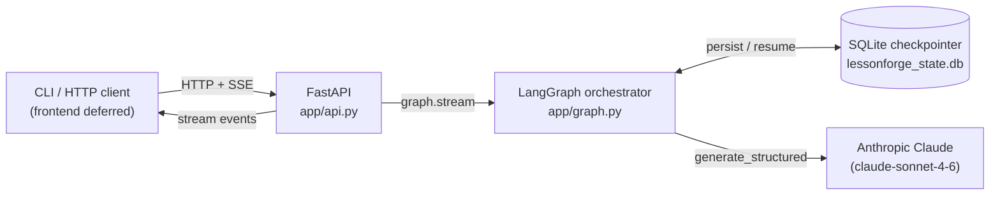
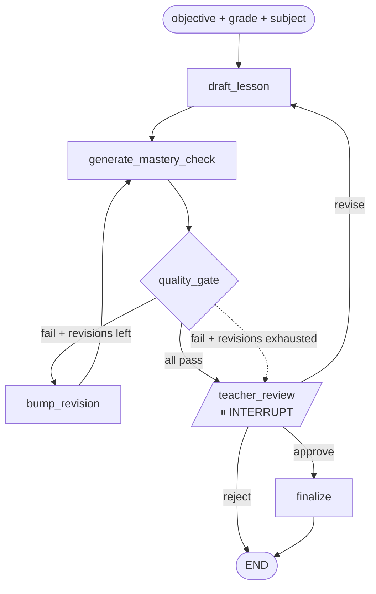

# LessonForge

**An agentic, human-in-the-loop generator for self-paced, mastery-based lessons.**

A teacher enters a learning objective, a grade level, and a subject. An
orchestrated graph of AI steps drafts the instruction, generates a mastery
check, scores its own work against a rubric, and **pauses for the teacher to
approve, revise, or reject** before anything is finalized. No AI-generated
content is ever treated as final without a human in the loop.

Built around the [Modern Classrooms](https://www.modernclassrooms.org/)
self-paced, mastery-based instructional model.

> The full design contract lives in [`SPEC.md`](./SPEC.md), written **before**
> any code — this project follows spec-driven development. Spec and
> implementation move together; if they ever disagree, fix one of them
> deliberately.

---

## What this demonstrates

A portfolio piece for production agentic engineering. Each pattern below is
small and load-bearing; together they form the playbook for shipping LLM
features that don't catch fire in production.

| Pattern | Where it lives |
|---|---|
| Graph-based orchestration with conditional edges | `app/graph.py` — four nodes, two conditional routes ([SPEC §3](./SPEC.md#3-the-graph)) |
| Structured outputs (validated JSON, never prose between nodes) | `app/schemas.py`, `app/llm.py` ([SPEC §4](./SPEC.md#4-structured-output-schemas)) |
| Human-in-the-loop interrupt / circuit breaker | `interrupt_before=["teacher_review"]` in `app/graph.py` |
| Durable execution — a paused graph survives a process restart | SQLite checkpointer wired in `app/api.py` and `app/run.py` |
| Bounded self-correction (RALPH) loop with an explicit completion promise | `route_after_quality` in `app/graph.py`, `MAX_QUALITY_REVISIONS=2` |
| Evaluation harness over a pinned dataset | `evals/run_evals.py` ([SPEC §5](./SPEC.md#5-evaluation-harness)) |
| Streaming transport mirroring the interrupt boundary | `app/api.py` — two SSE streams per lesson ([SPEC §6](./SPEC.md#6-api-contract-fastapi--graph)) |
| Single provider seam (one model, one place to swap) | `MODEL` constant in `app/llm.py` |
| Spec-driven development | This README + [`SPEC.md`](./SPEC.md) |

---

## Architecture

### System view



### Graph view



A single shared **state** flows through every node, picking up fields as it
goes. Each node returns a partial update; LangGraph merges it. The conditional
edge after `quality_gate` is a small **RALPH loop**: regenerate up to
`MAX_QUALITY_REVISIONS` times if quality fails, then surface the flawed draft
to the teacher rather than loop forever. The completion promise — the rule
that bounds the loop — is the central discipline of autonomous loops, and it
lives in code, not in hope.

The `teacher_review` interrupt is the human-in-the-loop circuit breaker. The
graph **pauses** there, persisting state via the checkpointer. The outside
world reads the paused state, collects the teacher's choice, writes it back,
and resumes. Because state is durable, the process can restart between pause
and resume without losing the run.

---

## Setup

Requires Python 3.10+ and an [Anthropic API key](https://console.anthropic.com/).

```bash
python -m venv .venv
source .venv/bin/activate              # Windows: .venv\Scripts\Activate.ps1
pip install -r requirements.txt
export ANTHROPIC_API_KEY=sk-...        # Windows: see CLAUDE.md for persistent setup
```

> Check the current model name in the Anthropic docs and update `MODEL` in
> `app/llm.py` if needed. Model strings change.

---

## Three ways to drive it

### 1. Headless CLI — full interrupt/resume cycle in the terminal

```bash
python -m app.run
```

Prompts for an objective, grade, and subject. Watch each node complete, see
the draft and quality report, then make the approve / revise / reject
decision. State persists to `lessonforge_state.db`, so you can kill the
process mid-pause and resume from where it stopped — the durable-execution
story in miniature.

### 2. Eval harness — regression test over a pinned dataset

```bash
python -m evals.run_evals
```

Runs the graph up to (but not through) the interrupt for each entry in
`evals/dataset.json` and prints a pass/fail table. Rerun after any prompt
edit to catch regressions. The point isn't a perfect grader — it's
demonstrating that AI behavior is tested like code, not eyeballed.

```
Running 6 eval cases...

[PASS] ela-3-main-idea
[PASS] math-8-two-step-equations
[PASS] sci-5-water-cycle
[PASS] ss-7-branches-of-government
[PASS] math-2-place-value
[PASS] ela-10-thesis-statement

ALL PASSED
```

### 3. HTTP API — FastAPI server with streamed progress

```bash
uvicorn app.api:app --reload
```

Then visit <http://127.0.0.1:8000/docs> for Swagger UI, or call the endpoints
directly. Two SSE endpoints mirror the graph's pause boundary:

- `POST /lessons` opens an event stream that emits `node_complete` events
  through `draft → check → quality`, then closes with `awaiting_review`.
- `POST /lessons/{id}/decision` opens a second stream that resumes the graph
  to `finalize` (or back through the loop on `revise`).

Full event-type reference and design rationale in
[SPEC §6](./SPEC.md#6-api-contract-fastapi--graph). The two-stream design
keeps the HTTP boundary aligned with the graph's pause boundary — no
background tasks, no shared queues, no concurrency surface.

---

## Project layout

| File | What it owns |
|---|---|
| [`SPEC.md`](./SPEC.md) | The design contract. Source of truth. |
| [`CLAUDE.md`](./CLAUDE.md) | Working conventions + build order for contributors. |
| `app/schemas.py` | Pydantic output contracts + the graph's shared state. |
| `app/llm.py` | Structured-output model wrapper; the single provider seam. |
| `app/nodes.py` | The four pipeline nodes (draft, check, quality, finalize). |
| `app/graph.py` | LangGraph wiring: edges, the RALPH loop, the interrupt. |
| `app/run.py` | Headless CLI driver + interrupt/resume cycle. |
| `app/api.py` | FastAPI transport with SSE streams. |
| `evals/dataset.json` | Pinned objectives spanning subjects and grade levels. |
| `evals/run_evals.py` | The eval harness. |

---

## Status

**Shipped:**

- Headless graph with all four nodes and conditional routing
- Pydantic schemas for every model output (no prose between nodes)
- Human-in-the-loop interrupt with durable resume
- Bounded self-correction (RALPH) quality loop
- Pinned eval harness (6 cases passing across grades 2–10 and four subjects)
- FastAPI transport with two-stream SSE matching the interrupt boundary

**Deliberately deferred:**

- **Angular + RxJS frontend.** The visible polish pass. The backend already
  streams the events a UI would subscribe to, so this is additive. The
  portfolio framing is *the backend is the proof; the frontend is the
  polish.*
- **Public deploy.** `POST /lessons` calls the Anthropic API on each
  invocation. Exposing it without auth, rate limiting, and a hard spend cap
  is a credit-burn risk for a single-developer project. Local-runnable is a
  deliberate choice, not an oversight.
- **Cross-provider benchmark.** A second model behind `generate_structured`
  with the eval harness reporting cost / latency / pass-rate. Stretch goal
  in [SPEC §5](./SPEC.md#5-evaluation-harness).
- **LMS export.** Google Classroom, Canvas. Future direction noted in
  [SPEC §9](./SPEC.md#9-out-of-scope-v1).
